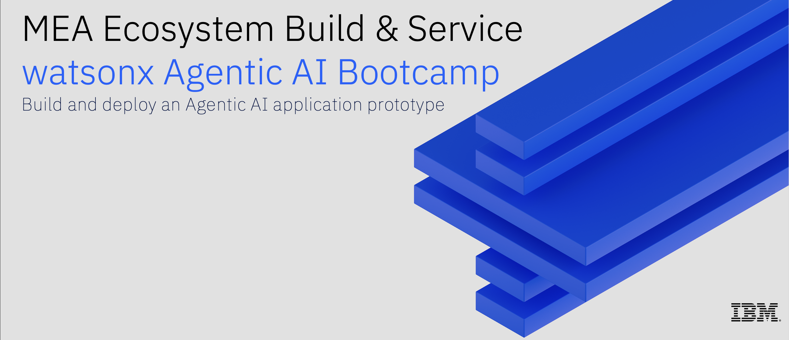

# 🤖 watsonx Agentic AI Bootcamp

In this bootcamp, you will build and deploy an Agentic AI application prototype for an enterprise use case.

🚀 You'll learn the concepts behind Agentic AI workflows.

🚀 You'll leverage IBM watsonx Orchestrate and open source tools for low-code fast prototyping of Agentic AI workflows.

🚀 You'll learn how to deploy an Agentic AI application and the trust considerations needed to go to production.

## Lab-0: IBM Cloud Setup - [Link](./Lab-0:IBM_Cloud_Setup)
- Setup the necessary credentails to be used in the Lab such as 
    - IBM Cloud API key
    - Project ID 
    - Deployment Space ID 

## Guided Lab & Demo
- [Intelligent assistant for Warehouse management](./Lab-1:Usecases/intelligent-assistant)
    - watsonx Orchestrate + watsonx.ai

## Lab-1: Business automation for Competitive Analysis -
- [Business automation for Competitive Analysis](./Lab-1:Usecases/business-automation)
    - watsonx Orchestrate + watsonx.ai
 
## Lab-2: Financial Research Analyst
- [Financial Research Analyst](./Lab-1:Usecases/banking-financial-research-analyst)
    - watsonx Orchestrate + Knowledge Base

## Optional Hands-on Labs

Note - You have access to the demo environment until **28-July-2025**, you can feel free to perform this labs on your own.

### HR Automation

- [HR automation](./Lab-1:Usecases/ask-hr) (Optional)
    -  Watsonx.Orchestrate + Knowledge Base + Custom deployment

### Lab-2: Custom Agent integration (CrewAI) - [Link](./Lab-2:Custom_Agent_Integration)
    - Integrate CrewAI agent in Watsonx.Orchestrate (Low code)

### Lab-3: Agent Development Kit [Link](./Lab-3:Agent_Development_Kit)

### Lab-4: MCP - [Link](./Lab-4:MCP)

    

