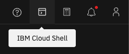
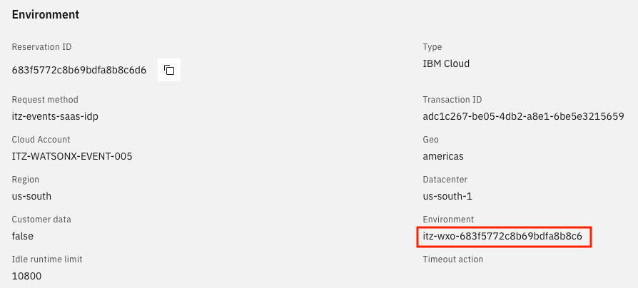

# Deploy the AskHR Backend Application via Automation script

These instructions will walk you thru the process to deploy the askhr [backend application](./HCM_APP) automatically within **IBM Cloud Serverless Containers (Code Engine)**. 

The **Tech Zone Code Engine** project is retrieved and used to deploy the application. The container image is built and pushed to the **Container Registry**. The application is created with a single instance. Changes can be made to the application deployment as needed. 

## Assumptions
- It is assumed this script is being run within the Agentic Bootcamp Tech Zone Instructors environment that includes **Code Engine**. For details on how to provision this, go [here](../../environment-setup/readme.md).
- This script also assumes that the **Code Engine** project is created as `ce-<resource-group-name>` and that a Container Registry namespace has been created.
  
## Prerequisites
- Create an unencrypted [SSH key](../../environment-setup/common/sshkey.md) (without a passphrase) and save the public key in your `github.ibm.com` user settings
- Create an [IBM Cloud API key](../../environment-setup/common/apikey.md) for the TechZone Cloud account

## Run application setup script

1. Set up environment

   There are two ways to run the setup script, from a local terminal or from the **IBM Cloud Shell**.
   - **Local terminal**

     Open a terminal window and make sure the **IBM Cloud CLI** is installed. See [Installing IBM Cloud CLI](https://cloud.ibm.com/docs/cli?topic=cli-install-ibmcloud-cli).
     
     NOTE: if newly installing the IBM Cloud CLI, you will also need to install the Container Registry plug-in:
     ```
     ibmcloud plugin install container-registry
     ```
     
    - **IBM Cloud Shell**

      To open a Cloud Shell, click the terminal icon on top right of the IBM Cloud UI.
     
      
  
      Copy the `id_rsa` private key (created in the [prerequisites](#prerequisites) steps) from your local system:
      ```
      cat ~/.ssh/id_rsa | pbcopy        # In Powershell, try "Set-Clipboard ~/.ssh/id_rsa"
      ```
    
      Save it into `.ssh/id_rsa` in the local Cloud Shell environment:
      ```
      mkdir .ssh
      vi .ssh/id_rsa
      ```
      Within the `vi` editor do the following:
      1. type `i` to go into insert mode
      2. type `Cmd|Ctl v` to paste the `id_rsa` private key you copied from your local system using `pbcopy`
      3. type `Esc` and then `:wq` to write and quit out of the `vi` editor

      Next, change permissions on the key file:
      ```
      chmod 600 .ssh/id_rsa
      ```

1. Set the following environment variables: 
   ```
   export PRIVATE_KEY_PATH="<path-to-your-private-key-file>"  # Optional: full pathname for id_rsa private ssh key if other than ~/.ssh/id_rsa
   export API_KEY="<your-ibm-cloud-api-key>"                  # Replace with your IBM Cloud API key
   export RESOURCE_GROUP="<your-techzone-environment-id>"     # Replace with your TechZone environment ID
   ```
   NOTE: The TechZone Environment ID (used for `RESOURCE_GROUP`) is found on TechZone reservation, see red rectangle in image below
   
       
2. Clone scripts into terminal or Cloud Shell:

   ```
   git clone git@github.ibm.com:skol/agentic-ai-client-bootcamp-instructors.git
   cd agentic-ai-client-bootcamp-instructors
   git checkout <branch-name>   # If deploying from a branch other than main
   ``` 

4. Run script:
   
   ```
   ./usecase-setup/askhr/code-engine-deploy.sh <branch-name>   # Github code branch to build from, defaults to main
   ```
   NOTE: If you are running this script on a fresh TechZone environment, it might complain with an authorization error:
   ```
   This action is forbidden. See the Code Engine documentation and ensure you have sufficient authorization within your account and resource group.
   ```
   Try rerunning the script to resolve this

5. Take note of output URL

   Take note of the URL produced by the script, you will need it in the final setup steps [here](./README.md#3-update-api-spec-file-with-deployment-url)
